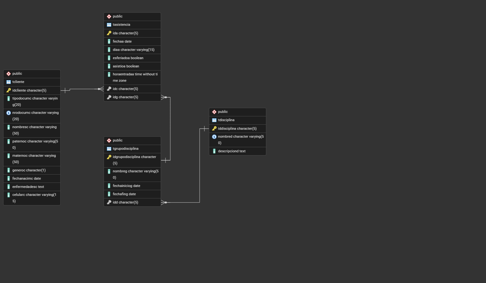

#Taller 1.2 : Implementación de Modelos Físicos

---
## Actividad 2: Sistema de registro de transacciones bancarias a nivel nacional (Super Giros)
**Motor de Base de Datos:** SQL Server

### Diagrama Físico


### Código SQL (Implementación)
```sql
USE Master
GO

IF DB_ID('DBSuperGiros') IS NOT NULL
	DROP DATABASE DBSuperGiros
GO

CREATE DATABASE DBSuperGiros
GO

USE DBSuperGiros
GO

-- Tabla Banco
IF OBJECT_ID('TBanco') IS NOT NULL
	DROP TABLE TBanco
GO

CREATE TABLE TBanco
(
	IdBanco INT PRIMARY KEY IDENTITY(1,1),
	NombreBanco VARCHAR(100) NOT NULL,
	PaginaWeb VARCHAR(150) NOT NULL
)
GO

-- Tabla Cliente
IF OBJECT_ID('TCliente') IS NOT NULL
	DROP TABLE TCliente
GO

CREATE TABLE TCliente
(
	IdCliente INT PRIMARY KEY IDENTITY(1,1),
	TipoDocumento VARCHAR(20) NOT NULL,
	NroDocumento VARCHAR(20) NOT NULL,
	Nombres VARCHAR(100) NOT NULL,
	Paterno VARCHAR(100) NOT NULL,
	Materno VARCHAR(100) NOT NULL,
	Celular VARCHAR(15) NOT NULL
)
GO

-- Tabla Empleado
IF OBJECT_ID('TEmpleado') IS NOT NULL
	DROP TABLE TEmpleado
GO

CREATE TABLE TEmpleado
(
	IdEmpleado INT PRIMARY KEY IDENTITY(1,1),
	TipoDocumento VARCHAR(20) NOT NULL,
	NroDocumento VARCHAR(20) NOT NULL,
	Nombres VARCHAR(100) NOT NULL,
	Paterno VARCHAR(100) NOT NULL,
	Materno VARCHAR(100) NOT NULL,
	Celular VARCHAR(15) NOT NULL
)
GO

-- Tabla Cuenta
IF OBJECT_ID('TCuenta') IS NOT NULL
	DROP TABLE TCuenta
GO

CREATE TABLE TCuenta
(
	IdCuenta INT PRIMARY KEY IDENTITY(1,1),
	NroCuenta VARCHAR(30) NOT NULL,
	SaldoCuenta DECIMAL(12,2) NOT NULL,
	IdBanco INT NOT NULL,
	IdCliente INT NOT NULL,

	CONSTRAINT FK_Banco_Cuenta FOREIGN KEY (IdBanco) REFERENCES TBanco(IdBanco),
	CONSTRAINT FK_Cliente_Cuenta FOREIGN KEY (IdCliente) REFERENCES TCliente(IdCliente)
)
GO

-- Tabla Operacion
IF OBJECT_ID('TOperacion') IS NOT NULL
	DROP TABLE TOperacion
GO

CREATE TABLE TOperacion
(
	IdOperacion INT PRIMARY KEY IDENTITY(1,1),
	TipoOperacion VARCHAR(50) NOT NULL,
	FechaHoraOperacion DATETIME NOT NULL,
	MontoOperacion DECIMAL(12,2) NOT NULL,
	ComisionOperacion DECIMAL(10,2) NOT NULL,
	IdCuenta INT NOT NULL,
	IdCliente INT NOT NULL,
	IdEmpleado INT NOT NULL,

	CONSTRAINT FK_Cuenta_Operacion FOREIGN KEY (IdCuenta) REFERENCES TCuenta(IdCuenta),
	CONSTRAINT FK_Cliente_Operacion FOREIGN KEY (IdCliente) REFERENCES TCliente(IdCliente),
	CONSTRAINT FK_Empleado_Operacion FOREIGN KEY (IdEmpleado) REFERENCES TEmpleado(IdEmpleado)
)
GO
```

## Actividad 3: Sistema de registro de asistencia del personal del INPE
**Motor de Base de Datos:** SQL Server

### Diagrama Físico


### Código SQL (Implementación)
```sql
USE Master 
GO

IF DB_ID('DBinpe') IS NOT NULL
	DROP DATABASE DBinpe
GO

CREATE DATABASE DBinpe
GO

USE DBinpe
GO

-- Tabla Empleado
IF OBJECT_ID('TEmpleado') IS NOT NULL
	DROP TABLE TEmpleado
GO

CREATE TABLE TEmpleado
(
	IdEmpleado INT PRIMARY KEY IDENTITY(1,1),
	tipoDocumento VARCHAR(20) NOT NULL,
	nroDocumento VARCHAR(20) NOT NULL,
	nombres VARCHAR(100) NOT NULL,
	paterno VARCHAR(100) NOT NULL,
	materno VARCHAR(100) NOT NULL,
	celular CHAR(100) NOT NULL,
	IdSupervisor INT UNIQUE NULL,

	CONSTRAINT FK_Empleado_Supervisor FOREIGN KEY (IdSupervisor) REFERENCES TEmpleado (IdEmpleado) 
)
GO

-- Tabla Turno
IF OBJECT_ID('TTurno') IS NOT NULL
	DROP TABLE TTurno
GO

CREATE TABLE TTurno
(
	IdTurno INT PRIMARY KEY IDENTITY(1,5),
	nombre VARCHAR(100) NOT NULL,
	inicio DATETIME,
	fin DATETIME
)
GO

-- Tabla Año
IF OBJECT_ID('TAño') IS NOT NULL
	DROP TABLE TAño
GO

CREATE TABLE TAño
(
	IdAño INT PRIMARY KEY,
	inicio DATETIME NOT NULL,
	fin DATETIME NOT NULL,
	IdTurno INT,

	CONSTRAINT FK_Turno_Año FOREIGN KEY (IdTurno) REFERENCES TTurno(IdTurno)
)
GO

-- Tabla Asistencia
IF OBJECT_ID ('TAsistencia') IS NOT NULL
	DROP TABLE TAsistencia
GO

CREATE TABLE TAsistencia
(
	IdAsistencia INT PRIMARY KEY,
	fecha DATETIME NOT NULL,
	dia VARCHAR(20) NOT NULL,
	Feriado VARCHAR(10) NOT NULL,
	asistio VARCHAR(10) NOT NULL,
	tardo VARCHAR(10) NOT NULL,
	horaEntrada DATETIME,
	horaSalida DATETIME,
	IdEmpleado INT,
	IdTurno INT UNIQUE,

	CONSTRAINT FK_Empleado_Asistencia FOREIGN KEY(IdEmpleado) REFERENCES TEmpleado(IdEmpleado),
	CONSTRAINT FK_Turno_Asistencia FOREIGN KEY(IdTurno) REFERENCES TTurno(IdTurno)
)
GO
```

## Actividad 4: Sistema de registro de venta de platillos y bebidas en la pollería “Don Gallino”
**Motor de Base de Datos:** MySQL

### Diagrama Físico


### Código SQL (Implementación)
```sql
CREATE DATABASE DonGallino;

USE DonGallino;

-- TABLA: Cliente
CREATE TABLE Cliente (
    idC INT AUTO_INCREMENT PRIMARY KEY,
    tipoDocum VARCHAR(20),
    nroDocum VARCHAR(20),
    nombres VARCHAR(100),
    paterno VARCHAR(50),
    materno VARCHAR(50),
    celular VARCHAR(15)
);

-- TABLA: Categoria
CREATE TABLE Categoria (
    idCat INT AUTO_INCREMENT PRIMARY KEY,
    nombreCat VARCHAR(100),
    descripcionCat VARCHAR(200)
);

-- TABLA: Producto
CREATE TABLE Producto (
    idP INT AUTO_INCREMENT PRIMARY KEY,
    nombreP VARCHAR(100),
    descripcionP VARCHAR(200),
    precioReferencialP DECIMAL(10,2),
    idCat INT,
    FOREIGN KEY (idCat) REFERENCES Categoria(idCat)
);

-- TABLA: Comprobante
CREATE TABLE Comprobante (
    idComp INT AUTO_INCREMENT PRIMARY KEY,
    fechaHoraComp DATETIME,
    totalComp DECIMAL(10,2),
    idC INT,
    FOREIGN KEY (idC) REFERENCES Cliente(idC)
);

-- TABLA: Detalle
CREATE TABLE Detalle (
    idDet INT AUTO_INCREMENT PRIMARY KEY,
    cantidadDet INT,
    precioRealUnitarioDet DECIMAL(10,2),
    subTotalDet DECIMAL(10,2),
    idComp INT,
    idP INT,
    FOREIGN KEY (idComp) REFERENCES Comprobante(idComp),
    FOREIGN KEY (idP) REFERENCES Producto(idP)
);
```
## Actividad 5: Sistema de registro de entrada y salida de electrodomésticos “Electro Track”
**Motor de Base de Datos:** MySQL

### Diagrama Físico


### Código SQL (Implementación)
```sql
-- TABLA: Proveedor
CREATE TABLE Proveedor (
    idP INT AUTO_INCREMENT PRIMARY KEY,
    razonSocialP VARCHAR(100),
    direccion VARCHAR(150)
);

-- TABLA: OrdenDeCompra
CREATE TABLE OrdenDeCompra (
    idOrden INT AUTO_INCREMENT PRIMARY KEY,
    fechaHoraOrden DATETIME,
    totalOrden DECIMAL(10,2),
    idP INT,
    FOREIGN KEY (idP) REFERENCES Proveedor(idP)
);

-- TABLA: Electrodomestico
CREATE TABLE Electrodomestico (
    idE INT AUTO_INCREMENT PRIMARY KEY,
    nombreE VARCHAR(100),
    marcaE VARCHAR(100),
    modeloE VARCHAR(100),
    precioVentaE DECIMAL(10,2),
    precioCompraE DECIMAL(10,2)
);

-- TABLA: Cliente
CREATE TABLE Cliente (
    idC INT AUTO_INCREMENT PRIMARY KEY,
    tipoDocumC VARCHAR(20),
    nombresC VARCHAR(100),
    nroDocumC VARCHAR(20),
    paternoC VARCHAR(50),
    maternoC VARCHAR(50),
    celularC VARCHAR(15)
);

-- TABLA: Comprobante
CREATE TABLE Comprobante (
    idComp INT AUTO_INCREMENT PRIMARY KEY,
    tipoComp VARCHAR(50),
    fechaHoraComp DATETIME,
    totalComp DECIMAL(10,2),
    idC INT,
    FOREIGN KEY (idC) REFERENCES Cliente(idC)
);

-- TABLA: detalleIngresoSalida
CREATE TABLE detalleIngresoSalida (
    idDet INT AUTO_INCREMENT PRIMARY KEY,
    tipoDet VARCHAR(50),
    subTotalDet DECIMAL(10,2),
    cantidadDet INT,
    idE INT,
    idOrden INT,
    idComp INT,
    FOREIGN KEY (idE) REFERENCES Electrodomestico(idE),
    FOREIGN KEY (idOrden) REFERENCES OrdenDeCompra(idOrden),
    FOREIGN KEY (idComp) REFERENCES Comprobante(idComp)
);
```


## Actividad 6: Sistema de registro de asistencia de enfermeras (Clínica Mac Salud)
**Motor de Base de Datos:** Oracle SQL

### Diagrama Físico


### Código SQL (Implementación)
```sql
-- Tabla Enfermero
CREATE TABLE Enfermero (
    idE NUMBER PRIMARY KEY,
    tipoDocumeE VARCHAR2(20),
    nroDocumeE VARCHAR2(20),
    nombresE VARCHAR2(100),
    paternoE VARCHAR2(100),
    maternoE VARCHAR2(100),
    fechaNacimientoE DATE,
    generoE VARCHAR2(10)
);

-- Tabla Ambiente
CREATE TABLE Ambiente (
    idAmb NUMBER PRIMARY KEY,
    nroAmb VARCHAR2(20),
    ubicacionAmb VARCHAR2(100)
);

-- Tabla Calendario
CREATE TABLE Calendario (
    idC NUMBER PRIMARY KEY,
    inicioC DATE,
    finC DATE,
    nombreC VARCHAR2(100)
);

-- Tabla Asistencia
CREATE TABLE Asistencia (
    idA NUMBER PRIMARY KEY,
    fechaA DATE,
    diaA VARCHAR2(20),
    asistioA VARCHAR2(10),
    tardoA VARCHAR2(10),
    horaEntradaA VARCHAR2(10),
    horaSalidaA VARCHAR2(10),
    justificacionA VARCHAR2(200),
    esDescansoA VARCHAR2(10),
    idE NUMBER,
    idAmb NUMBER,
    idC NUMBER,
    CONSTRAINT fk_enfermero FOREIGN KEY (idE) REFERENCES Enfermero(idE),
    CONSTRAINT fk_ambiente FOREIGN KEY (idAmb) REFERENCES Ambiente(idAmb),
    CONSTRAINT fk_calendario FOREIGN KEY (idC) REFERENCES Calendario(idC)
);
```

## Actividad 7: Sistema de facturación electrónica (Pollería Los Ángeles)
**Motor de Base de Datos:** Oracle SQL

### Diagrama Físico


### Código SQL (Implementación)
```sql
-- Tabla Cliente
CREATE TABLE Cliente (
    idC NUMBER PRIMARY KEY,
    tipoDocumC VARCHAR2(20),
    nroDocumC VARCHAR2(20),
    nombresC VARCHAR2(100),
    paternoC VARCHAR2(100),
    maternoC VARCHAR2(100),
    celularC VARCHAR2(20)
);

-- Tabla Categoria
CREATE TABLE Categoria (
    idCat NUMBER PRIMARY KEY,
    nombreCat VARCHAR2(100),
    descripcionCat VARCHAR2(200)
);

-- Tabla Producto
CREATE TABLE Producto (
    idP NUMBER PRIMARY KEY,
    nombreP VARCHAR2(100),
    decripcionP VARCHAR2(200),
    precioReferencialP NUMBER(10,2),
    idCat NUMBER,
    CONSTRAINT fk_categoria FOREIGN KEY (idCat) REFERENCES Categoria(idCat)
);

-- Tabla Comprobante
CREATE TABLE Comprobante (
    idComp NUMBER PRIMARY KEY,
    fechaHoraComp DATE,
    totalComp NUMBER(10,2),
    idC NUMBER,
    CONSTRAINT fk_cliente FOREIGN KEY (idC) REFERENCES Cliente(idC)
);

-- Tabla Detalle
CREATE TABLE Detalle (
    idDet NUMBER PRIMARY KEY,
    cantidadDet NUMBER,
    precioRealUnitarioDet NUMBER(10,2),
    subtotalDet NUMBER(10,2),
    idComp NUMBER,
    idP NUMBER,
    CONSTRAINT fk_comprobante FOREIGN KEY (idComp) REFERENCES Comprobante(idComp),
    CONSTRAINT fk_producto FOREIGN KEY (idP) REFERENCES Producto(idP)
);
```
## Actividad 8: Gimnasio Titanium
**Motor de Base de Datos:** PostgreSQL

### Diagrama Físico


### Código SQL (Implementación)
```sql
-- 1. Tabla Cliente
CREATE TABLE TCliente
(
    IdCliente CHAR(5) PRIMARY KEY, 
    tipoDocumC VARCHAR(20),
    nroDocumC VARCHAR(20) UNIQUE NOT NULL, 
    nombresC VARCHAR(50) NOT NULL,  
    paternoC VARCHAR(50) NOT NULL, 
    maternoC VARCHAR(50),
    generoC CHAR(1),
    fechaNacimC DATE,
    enfermedadesC TEXT, 
    celularC VARCHAR(15)
);

-- 2. Tabla Disciplina
CREATE TABLE TDisciplina
(
    IdDisciplina CHAR(5) PRIMARY KEY,
    nombreD VARCHAR(50) UNIQUE NOT NULL,  
    descripcionD TEXT
);

-- 3. Tabla GrupoDisciplina
CREATE TABLE TGrupoDisciplina
(
    IdGrupoDisciplina CHAR(5) PRIMARY KEY,
    nombreG VARCHAR(50) NOT NULL,          
    fechaInicioG DATE,
    fechaFinG DATE,
    idD CHAR(5) NOT NULL,                 
    FOREIGN KEY(idD) REFERENCES TDisciplina(IdDisciplina)
);

-- 4. Tabla Asistencia
CREATE TABLE TAsistencia
(
    idA CHAR(5) PRIMARY KEY,
    fechaA DATE NOT NULL,                  
    diaA VARCHAR(15),
    esferiadoA BOOLEAN,
    asistioA BOOLEAN,
    horaEntradaA TIME,
    idC CHAR(5) NOT NULL,                 
    idG CHAR(5) NOT NULL,                 
    FOREIGN KEY(idC) REFERENCES TCliente(IdCliente),
    FOREIGN KEY(idG) REFERENCES TGrupoDisciplina(IdGrupoDisciplina)
);
```
